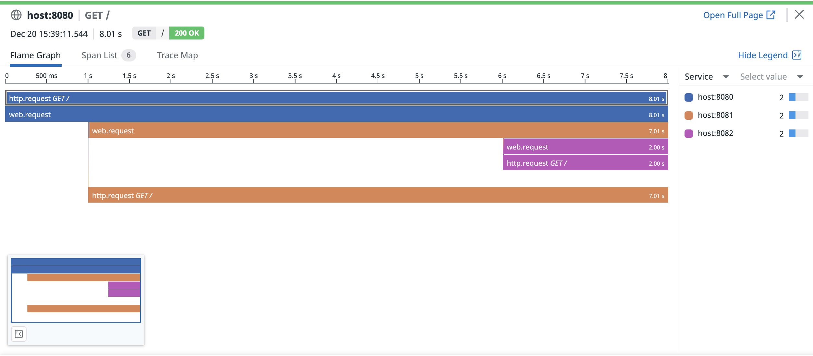
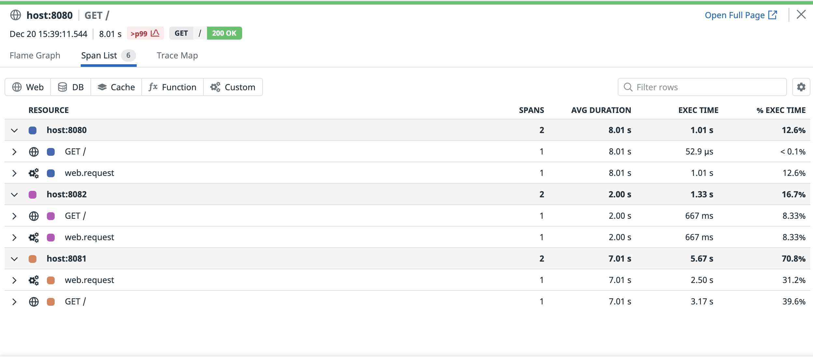
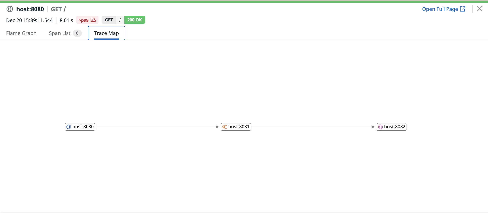
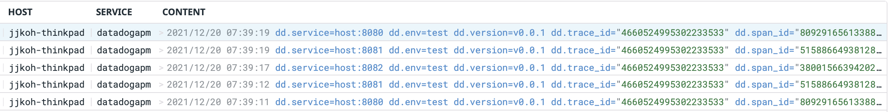

# Datadog APM
- How to setup APM
- How to setup distributed tracing

## How to run
```bash
export DATADOG_API_KEY=???

# create network
make create-network

# start datadog agent
make start-datadog-agent

# build container
make build-server

# start services
make start-server-8080
make start-server-8081
make start-server-8082

# make GET request
curl --location --request GET 'http://localhost:8080/'
```

## Result





## Reference
- https://docs.datadoghq.com/tracing/setup_overview/custom_instrumentation/go/
